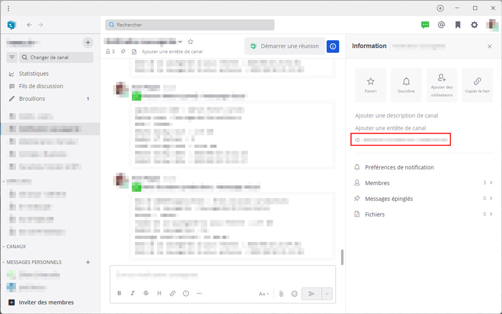

# Infomaniak's kChat Notifications Channel for Laravel

This package makes it easy to send notifications using [kChat](https://www.infomaniak.com/en/kchat) with Laravel 5.5+, 6.x, 7.x, 8.x, 9.x, 10.x


This package leverages Infomaniak's public API to send notification to [kChat](https://www.infomaniak.com/en/kchat) channels with Laravel 5.5+, 6.x, 7.x, 8.x, 9.x and 10.x

```php
return KChatMessage::create()
    ->to("123456789")
    ->content('The backup of your application succeeded')
    ->commentTo('987654321');
```

## Contents

- [Installation](#installation)
	- [Setting up the kChat service](#setting-up-the-kchat-service)
- [Usage](#usage)
	- [Available Message methods](#available-message-methods)
    - [Retrieve the kChat channel ID](#retrieve-the-kchat-channel-id)
    - [Use Markdown in the message](#use-markdown-in-the-message)
- [Changelog](#changelog)
- [Testing](#testing)
- [Security](#security)
- [Contributing](#contributing)
- [Credits](#credits)
- [License](#license)


## Installation

You can install the package via composer:

``` bash
composer require karacweb/kchat-notification-channel
```

Next, if you're using Laravel _without_ auto-discovery, add the service provider to `config/app.php`:

```bash
'providers' => [
    // ...
    NotificationChannels\KChat\KChatServiceProvider::class,
],
```

### Setting up the kChat service

* [Create a token with the scope `kchat`](https://manager.infomaniak.com/v3/ng/accounts/token/add)
* Retrieve the Url of your kChat instance, it should look like `https://your-team.kchat.infomaniak.com`.
* Paste the token and your kChat base Url in your `config/services.php` file:
  ```
  // config/services.php
  'infomaniak_kchat' => [
      'token' => 'YOUR_API_TOKEN',
      'base_url' => 'https://your-team.kchat.infomaniak.com' 
  ],
  ```

## Usage

Now you can use the channel in your `via()` method inside the notification:

```php
use Illuminate\Notifications\Notification;
use NotificationChannels\KChat\KChatChannel;
use NotificationChannels\KChat\KChatMessage;

class BackupSucceeded extends Notification
{
    public function via($notifiable)
    {
        return [KChatChannel::class];
    }

    public function toKChat($notifiable)
    {
        return KChatMessage::create()
            ->to("123456789")
            ->content('The backup of your application succeeded')
            ->commentTo('987654321'); // A post ID you wish to respond to
    }
}
```


Instead of using the `to($channel_id)` method for specifying the channel ID you can also add the `routeNotificationForKChat` method inside your Notifiable model. This method needs to return the channel ID.

```php
public function routeNotificationForKChat(Notification $notification)
{
    return '123456789';
}
```

### Available Message methods

- `to(string $channel_id)`: The channel to send the message to.
- `content(string $content)`: Content of the message (Markdown supported).
- `commentTo(string $post_id)`: A post ID you wish to respond to.

### Retrieve the kChat channel ID



### Use Markdown in the message

```php
// app/Notifications/InterestingNotification.php
public function toKChat($notifiable)
{
    return KChatMessage::create()
        ->to("123456789")
        ->content(view('notificationTemplate', [
            'variable' => 'ABC',
        ]));
}
```

```php
// resources/views/notificationTemplate.blade.php
** ✅ Bold title **

Lorem ipsum *dolor* sit amet, ~~consectetur~~ adipiscing elit...

Variable content {{ $variable }}

```

## Changelog

Please see [CHANGELOG](CHANGELOG.md) for more information what has changed recently.

## Testing

``` bash
$ composer test
```

## Security

If you discover any security related issues, please email info@karac.ch instead of using the issue tracker.

## Contributing

Please see [CONTRIBUTING](CONTRIBUTING.md) for details.

## Credits

- [karac web Sàrl](https://karac.ch)

## License

The MIT License (MIT). Please see [License File](LICENSE.md) for more information.
